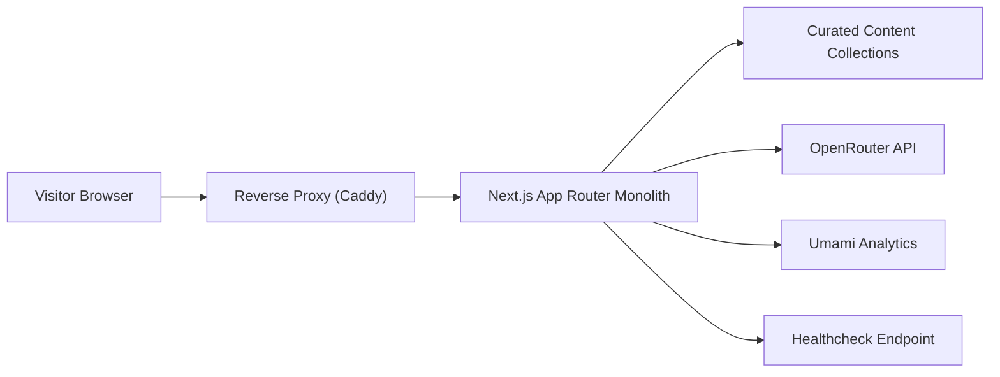
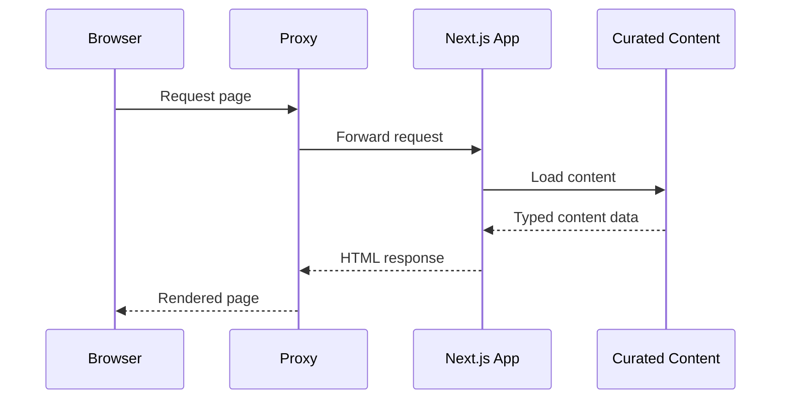
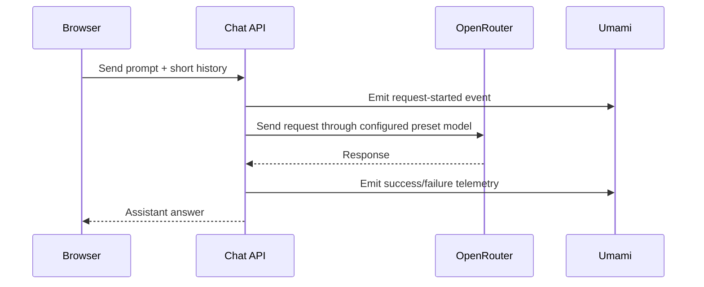
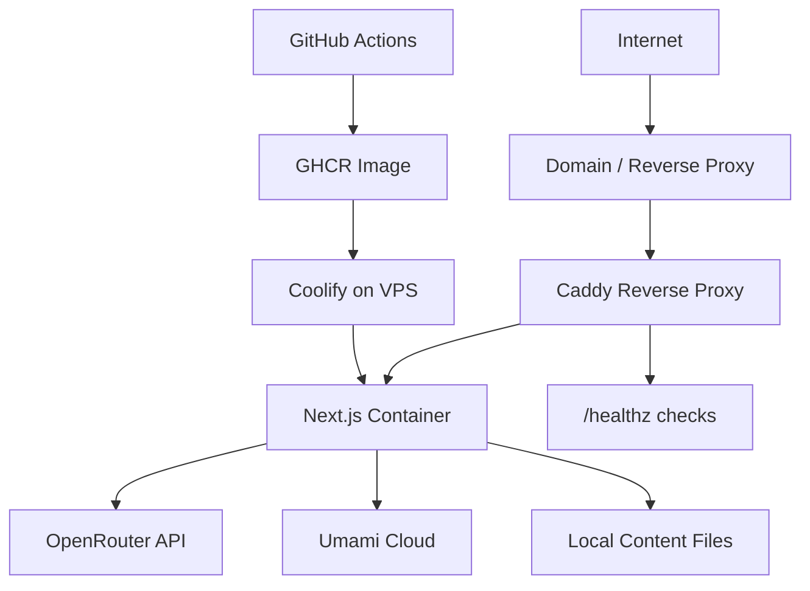

# ~guilhermeledes.github.io~

Public technical documentation for Guilherme Ledes's current portfolio platform.

The live site is served at [guilhermeledes.dev](https://guilhermeledes.dev/). This repository remains public as the GitHub Pages redirect entrypoint and as a lightweight public architecture reference for the live portfolio system.

## Overview

The portfolio is a content-driven web application designed to present Guilherme Ledes's professional profile, selected roles, curated project case studies, and a grounded AI-assisted Q&A experience.

The platform is intentionally small:

- one web application
- one reverse proxy
- curated content stored in-repo
- no database
- no background workers
- no persistent user accounts

The design goal is to keep the system operationally simple while still supporting:

- recruiter-facing landing content
- project detail pages
- print-friendly CV presentation
- SEO metadata
- grounded AI answers over curated portfolio content
- privacy-first analytics and chat reliability visibility
- containerized deployment on a VPS

The visual design direction for the portfolio was created with [Lovable](https://lovable.dev/), then implemented in the application codebase.

## High-Level Design

At a high level, the system is a monolithic `Next.js` application behind a reverse proxy. Content is authored as structured files, loaded at build/runtime by the app, and reused across the public pages and the grounded chat experience.

## Main Runtime Components

### 1. Web application

The application is built as a `Next.js` App Router monolith. It is responsible for:

- rendering the public pages
- loading and validating authored content
- generating SEO metadata
- exposing the chat API
- exposing the print-friendly CV route
- persisting the user-selected light/dark theme
- brokering chat requests to the configured AI preset
- emitting privacy-first analytics events

### 2. Content layer

The portfolio content is curated rather than CMS-driven. The source model is organized into collections such as:

- `profile`
- `roles`
- `projects`

This content powers:

- the home page
- project detail pages
- the CV route
- the grounded portfolio narratives exposed by the AI experience

### 3. AI provider integration

The application sends chat requests to `OpenRouter` using a portfolio-specific preset configured on the OpenRouter platform and referenced by the app as the selected model. This keeps the provider integration narrow while letting prompt and assistant behavior stay centrally managed in the OpenRouter preset.

### 4. Reverse proxy

`Caddy` fronts the application in deployment. It handles:

- inbound HTTP traffic
- proxying to the app container
- coarse request handling concerns
- healthcheck-aware readiness in the deployment setup

### 5. Analytics and observability

The public site uses `Umami Cloud` for lightweight, privacy-first analytics. It is used for:

- pageviews and sessions
- top pages and referrers
- key click and conversion-like events
- chat reliability telemetry around the `OpenRouter` integration

By design, the analytics layer avoids collecting PII and does not send raw chat prompts or answers.

## Primary Flows

### Public page rendering

### Grounded chat request

## Technology Stack

Core application stack:

- `Next.js`
- `React`
- `TypeScript`
- `Tailwind CSS`

Content:

- MDX-based curated content

AI integration:

- `OpenRouter`

Observability:

- `Umami Cloud`

Quality and validation:

- `Biome`
- `Vitest`
- `Playwright`

Deployment:

- `Docker`
- `Docker Compose`
- `Caddy`
- `GitHub Actions`
- `GHCR`
- `Coolify`
- VPS hosting

## Deployment Topology

The deployment model favors low operational overhead:

- one application container
- one proxy container
- no data plane services
- environment-variable-based runtime configuration
- image build/publish in GitHub Actions
- image rollout through Coolify from `GHCR`

## Operational Notes

This GitHub Pages repository is not the application runtime. It only redirects legacy traffic from `guilhermeledes.github.io` to the live domain.
